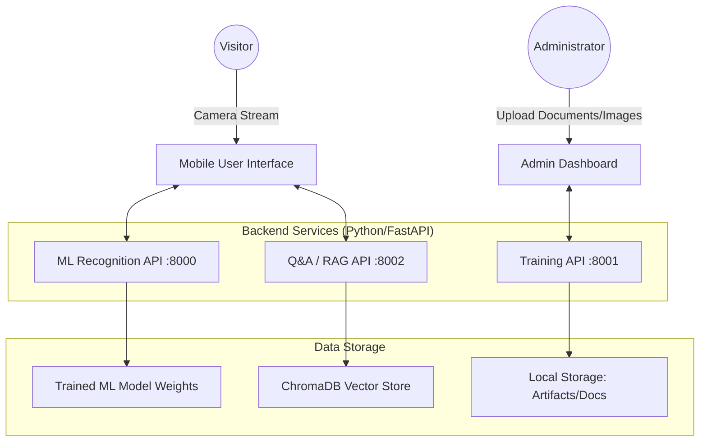
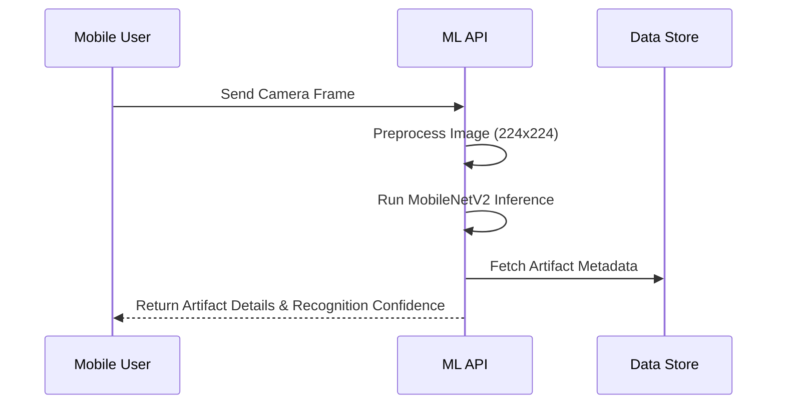
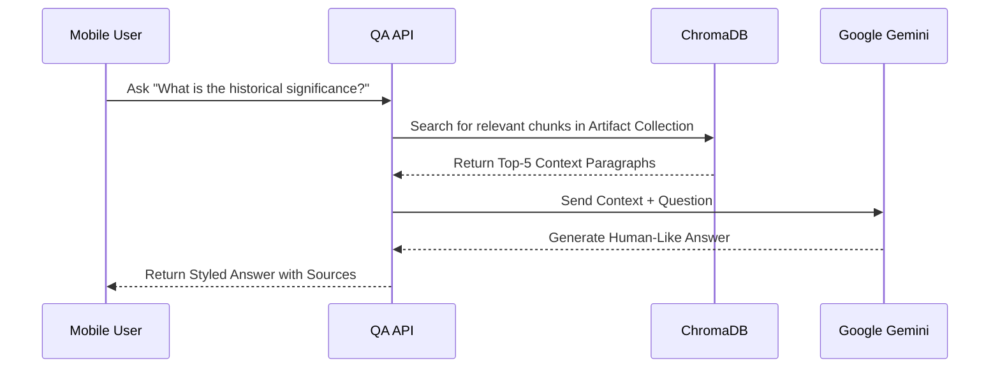

# Project Report: AR-Based Intelligent Museum Guide

## 1. Project Overview
The **AR-Based Intelligent Museum Guide** is an advanced interactive platform designed to enhance the museum experience by integrating Augmented Reality (AR) with Artificial Intelligence (AI). The system allows visitors to recognize artifacts using their mobile camera and interact with a Retrieval-Augmented Generation (RAG) chatbot to ask detailed questions grounded in verified museum documentation.

## 2. System Architecture

The project is built on a distributed micro-API architecture to ensure modularity and scalability:

## 3. Core Functional Modules

### 3.1 Artifact Recognition Engine (ML API)
*   **Model**: Utilizes **MobileNetV2**, a lightweight deep learning architecture optimized for mobile devices.
*   **Training**: Implements transfer learning to recognize specific museum artifacts from user-provided images.
*   **Inference**: Processes real-time camera frames, returning identification confidence and artifact metadata.
*   **Dynamic Reloading**: The API automatically reloads the model weights whenever administrators trigger a retraining cycle, ensuring zero downtime.

### 3.2 Retrieval-Augmented Generation (RAG) Q&A (QA API)
*   **Ingestion**: Administrators upload PDF guides/research papers for each artifact.
*   **Vectorization**: Documents are split into overlapping chunks and converted into high-dimensional embeddings using the `all-MiniLM-L6-v2` SentenceTransformer.
*   **Storage**: Embeddings are stored in **ChromaDB**, an open-source vector database.
*   **Generation**: When a user asks a question, the system:
    1.  Retrieves the top-5 most relevant text chunks from ChromaDB.
    2.  Constructs a context-aware prompt.
    3.  Uses **Google Gemini 1.5 Flash** to generate a fact-grounded response.

### 3.3 Training & Management (Training API)
*   Handles the lifecycle of the system, including artifact creation, image/document management, and model orchestration.
*   Features an asynchronous task queue for training to prevent UI hangs during heavy computation.

## 4. Operational Flow Diagrams

### 4.1 Recognition & Analysis Flow

### 4.2 RAG Q&A Flow

## 5. Technical Innovations
*   **Lazy Model Loading**: Optimized server startup by deferring the loading of heavy AI models until the first user request, ensuring the API is instantly ready.
*   **CORS & Mobile Optimization**: Configured with dynamic origin handling and `playsinline` camera support for seamless operation across iOS and Android browsers.
*   **Single-View UX**: Redesigned the user interface into a fluid, single-page experience moving from Camera -> Details -> Q&A without page reloads.

## 6. Conclusion
This project successfully demonstrates the fusion of computer vision and large language models in a practical, real-world scenario. By leveraging RAG, we ensure that the AI's "knowledge" is strictly grounded in the museum's own verified documents, eliminating "hallucinations" and providing visitors with a reliable, educational, and engaging guide.
